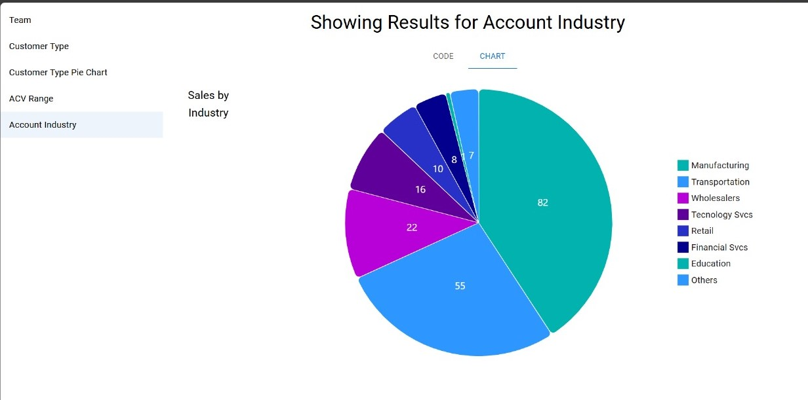
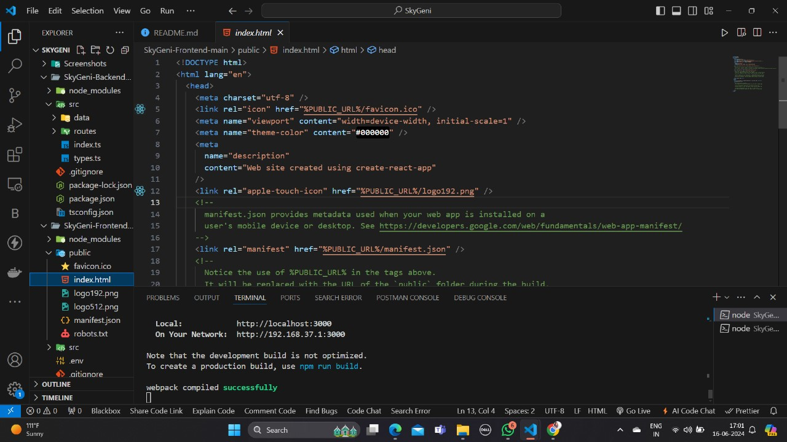

# ChartCrafter - DataVizTool






## Installation Guide

### Requirements
- [Nodejs](https://nodejs.org/en/download)
- [React]
- [TypeScript]

## check git ignore 
-check git ignore file and load the dependencies

## For Frontend.
```terminal
cd SkyGeni-Frontend
npm run start
 localhost:3000
```
## For Backend.

Open another terminal in folder, connect mongodb in background.
```terminal
cd SkyGeni-Backend
npm start
 localhost:5050
```
Here we are Done! Now go to localhost:3000 in the browser.
